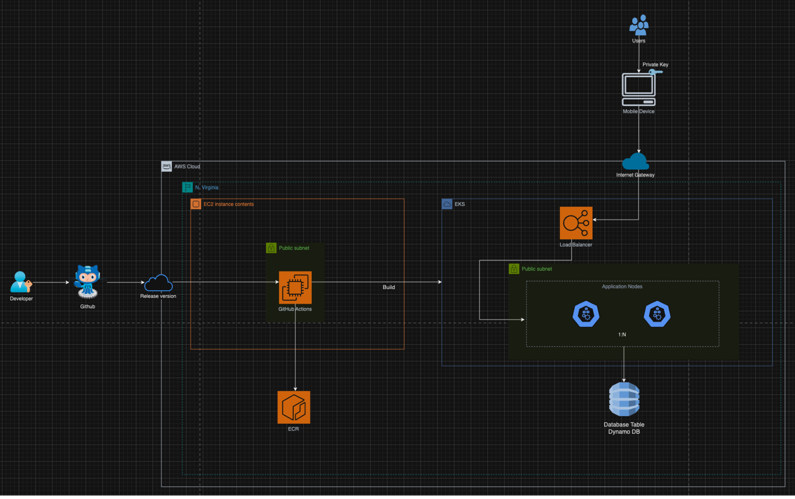

# Arquitetura do Sistema

## Componentes Principais:

### API Gateway:
- **Funcionalidade:** Centraliza todas as requisições para os serviços backend.
- **Ferramenta recomendada:** AWS API Gateway.

### Serviços Backend:
- **Serviço de Autenticação:** Gerencia login, logout e autenticação de usuários.
- **Serviço de Agendamento:** Gerencia horários disponíveis, agendamentos e cancelamentos.
- **Serviço de Teleconsulta:** Gerencia sessões de consulta online.
- **Serviço de Prontuário Eletrônico:** Gerencia upload, download e compartilhamento de prontuários.
- **Serviço de Notificações:** Envia notificações via email e SMS.

### Banco de Dados:
- **Funcionalidade:** Armazena dados de usuários, agendamentos, prontuários, etc.
- **Banco de dados recomendado:** 
  - Amazon RDS (PostgreSQL) para dados relacionais.
  - Amazon DynamoDB para documentos médicos.

### Serviço de Terceiros:
- **Serviço de Integração Online:** Integração com serviço de videoconferência como Zoom ou Google Meet.
- **Serviço de Notificações:** Integração com serviço de email/SMS como AWS SES e SNS.

### Infraestrutura:
- **Provedor de nuvem:** AWS.
- **Características:** Alta disponibilidade e escalabilidade.

### CI/CD Pipeline:
- **Ferramenta recomendada:** GitHub Actions.

## Entidades e Endpoints:

### Endpoints:
- `/app/admin`:
  - **CRUD Operations:** Consultas.

- `/app/user/appointment`:
  - **CRUD Operations:** Gerenciamento de consultas.

- `/app/user/patient`:
  - **CRUD Operations:** Gerenciamento de informações de médicos e login (CRM, Password).

- `/app/user/patient`:
  - **CRUD Operations:** Gerenciamento de informações de pacientes e login (Email, CPF, Password).

- `/app/record`:
  - **Funcionalidade:** Gerenciamento de links de prontuários online.

- `/app/protocols`:
  - **Funcionalidade:** Upload, download e compartilhamento de documentos médicos.

- `/app/notifications`:
  - **Funcionalidade:** Envio de notificações via email e SMS.

## Justificativas das Escolhas Técnicas Atualizadas:

### API Gateway:
- **Motivo:** Centraliza todas as requisições, facilita o gerenciamento de tráfego e segurança.

### Backend:
- **Framework:** 
  - Spring Boot: Alternativa para quem prefere Java, oferece robustez e integração facilitada com diversos serviços.
- **SDK:** 
  - Boto3 com Express.js: Escolhido pela alta performance em VOD e escalabilidade.

### Banco de Dados:
- **Motivo:**
  - Amazon RDS (PostgreSQL): Relacional, robusto e confiável para dados estruturados.
  - Amazon DynamoDB: Ideal para armazenamento de documentos médicos que podem variar em formato e tamanho.

### Infraestrutura:
- **Motivo:** AWS, provedor de nuvem líder, oferece alta disponibilidade, escalabilidade, e ferramentas integradas de segurança.

### CI/CD Pipeline:
- **Motivo:** GitHub Actions, ferramenta popular para automação de deploys, integração contínua e verificação de qualidade.

## Descrição de como os Requisitos Não Funcionais serão Atendidos:

- **Alta Disponibilidade:**
  - Uso de balanceadores de carga (AWS Elastic Load Balancer) para distribuir o tráfego.
  - Instâncias redundantes para alta disponibilidade.
  - Configuração de failover de bancos de dados com o uso de bancos de dados (Amazon RDS Multi-AZ).

- **Segurança:**
  - Autenticação de dois fatores em microsserviços, primando independência de componentes.
  - Contêineres isolados em clusters (Amazon ECS) com IPS para garantir a escalabilidade e segurança de serviços.
  - Auto-Scaling configurado para monitorar automaticamente a capacidade de recursos com base na demanda.

- **Performance:**
  - Uso de cache para armazenamento de dados rápidos (Redis).
  - Uso de instâncias otimizadas para processamento intensivo de dados (AWS EC2).

- **Cópias de Segurança e Recuperação de Desastres:**
  - Backup diário automático de banco de dados.
  - Recuperação automática em caso de falha (RTO: <1h).

- **Monitoramento:**
  - Utilização de ferramentas de monitoramento e alerta (AWS CloudWatch, AWS X-Ray).

## Entidades:

### User:
- id (string)
- username (string)
- password (string)
- email (string)
- createdAt (time)

### Appointment:
- id (string)
- patientId (string)
- scheduleDate (time)
- description (string)
- createdAt (time)

### Patient:
- id (string)
- name (string)
- email (string)
- cpf (string)
- createdAt (time)

### Record:
- id (string)
- patientId (string)
- documentType (string)
- url (string)
- createdAt (time)

### Protocol:
- id (string)
- description (string)
- createdAt (time)

### Notification:
- id (string)
- userId (string)
- type (string)
- content (string)
- sentAt (time)

## Diagrama de Arquitetura

